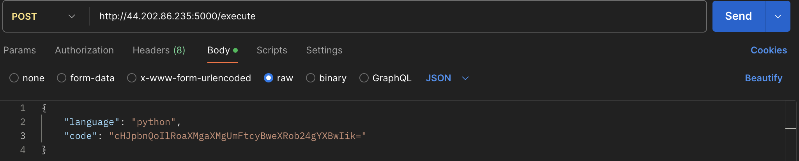
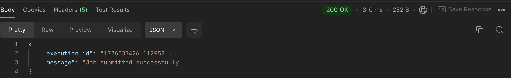
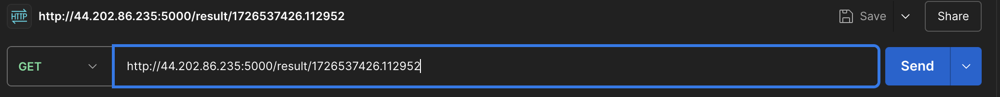
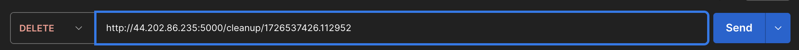
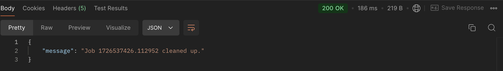
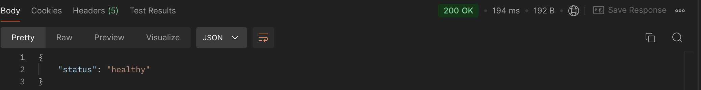
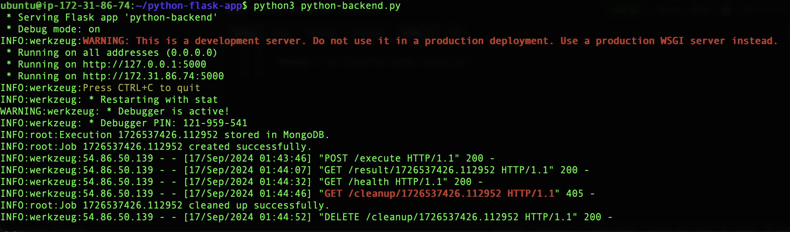

# Python-backend-microservice


This is a Python backend microservice built using Flask, designed to accept and execute user-submitted Python code in a Kubernetes environment. The service utilizes MongoDB to store execution metadata and results.

## Features

- **Code Execution**: Accepts base64-encoded Python code and executes it in a Kubernetes job.
- **Result Retrieval**: Users can retrieve the status and output of their submitted code executions.
- **Data Persistence**: Execution metadata and results are stored in a MongoDB database.

## Technologies Used

- Python 3.9
- Flask
- MongoDB
- Kubernetes
- Docker
- Terraform
- AWS

## Getting Started

### Prerequisites

- Docker installed on your machine.
- Access to a Kubernetes cluster.
- MongoDB instance (either local or cloud-based).
- Required Python packages listed in `requirements.txt`.

## EKS CLUSTER USING TERRAFORM

This section covers the steps to create an AWS EKS cluster using Terraform with a remote backend for state storage and state locking.

### 1. Initialize AWS CLI
Before setting up Terraform, configure your AWS CLI with appropriate credentials:
```
aws configure
```

### 2. Setup Terraform Remote Backend with State Locking
In this setup, we use Amazon S3 for storing the Terraform state file and DynamoDB for state locking to prevent concurrent state updates.

Remote Backend: We use an S3 bucket to store the Terraform state file.
State Locking: DynamoDB is used to implement state locking.

### 3. Define the EKS Cluster Infrastructure
In the Terraform configuration, we define an EKS cluster, VPC, subnets, and IAM roles needed for Kubernetes.

You can use the eks module from Terraform’s AWS provider for simplified management of the EKS cluster.

### 4. Initialize and Apply Terraform
Run the following commands to initialize and create the infrastructure:
```
# Initialize Terraform and configure remote backend
terraform init

# Validate the configuration
terraform validate

# Plan the infrastructure changes
terraform plan

# Apply the changes to create the EKS cluster
terraform apply
```

Once applied, Terraform will output the necessary details, including the EKS cluster and the worker nodes.

### 5. Configure kubectl to Use the New EKS Cluster
```
aws eks --region <your-region> update-kubeconfig --name my-eks-cluster
```
This command configures kubectl to point to your new EKS cluster.


## DATABASE SELECTION - MONGODB
#### Why Choose MongoDB Atlas?

I chose MongoDB Atlas over a self-hosted MongoDB solution for several reasons:

- **Managed Service**: Atlas provides a fully managed database service, reducing the operational overhead of maintaining the database.
- **Scalability**: It offers easy scalability options to accommodate varying workloads without manual intervention.
- **Built-in Security**: Atlas includes features like automated backups, end-to-end encryption, and compliance with various security standards.
- **Global Reach**: It allows deploying databases across multiple cloud regions, ensuring low-latency access for users worldwide.


### Installation

#### Using MongoDB Atlas

1. **Create a MongoDB Atlas account**: Go to [MongoDB Atlas](https://www.mongodb.com/cloud/atlas) and sign up for a free account.

2. **Create a new cluster**: Follow the prompts to set up a new cluster.

3. **Whitelist your IP address**: Go to the Network Access section and add your current IP address to allow connections.

4. **Create a database user**: In the Database Access section, create a new user with the necessary permissions.

5. **Get the connection string**: Navigate to the Cluster dashboard, click on "Connect", and copy the connection string provided. Replace the username and password placeholders in the string.

6. **Update the MongoDB connection string in `python-backend.py`**:

   ```
   mongo_client = MongoClient("<your-mongodb-atlas-connection-string>")
   ```

## HOW TO RUN THE APPLICATION IN LOCAL MACHINE
### Clone the repository:
First, clone the repository to your local machine
   ```
   git clone <repository-url>
   cd <repository-directory>
   ```

### Run the application locally:
Once you have the environment ready with Kubernetes cluster, python and pip installed, run the application with the following command
```
pip3 install -r requirements.txt
python3 python-backend.py
```

#### The application will be accessible at http://localhost:5000 or if you're running in cloud server http://<public ip>:5000.


# HOW TO VALIDATE THE API ACTIONS (GET, POST, DELETE)?
## API Endpoints

I have used POSTMAN in this project. 
You can use curl command from the Linux terminal to get the json output. Either way is preffered but POSTMAN has UI which is a better interface than curl.

Go to POSTMAN website, create an account if you don't have one. 
Start with /execute, then /result/execution_id, finally /cleanup/execution_id


#### 1. POST /execute - Submit Python code for execution
In header add: (This header ensures that the request body is treated as JSON.)
```
Content-Type: application/json
```

Request Body:
```
{
  "code": "<base64-encoded Python code>",
  "language": "python"
}
```




Response:
```
{
  "execution_id": "<unique execution ID>",
  "message": "Job submitted successfully."
}
```




#### 2. GET /result/<execution_id> - Get the result of the executed job



Response:
```
{
  "execution_id": "<execution ID>",
  "code": "<original Python code>",
  "output": "<execution output>",
  "status": "success/failed",
  "timestamp": "<timestamp>"
}
```


#### 3. DELETE /cleanup/<execution_id> - Cleanup the Kubernetes job



Response:
```
{
  "message": "Job <execution_id> cleaned up."
}
```




#### 4. GET /health - Health check for the service


Response:
```
{
  "status": "healthy"
}
```




In terminal you'll see:




# BELOW STEPS ARE OPTIONAL 

Creating a docker image of the application and deploying it to kubernetes.

### Here's why this process is essential:

#### 1. Consistency Across Environments
Docker Image: Docker allows you to package the application along with all its dependencies, ensuring that the application behaves the same in any environment. This eliminates the "works on my machine" problem because the Docker container encapsulates the application's runtime, libraries, and environment variables.
Kubernetes: By deploying the Dockerized application on Kubernetes, you can ensure that the same image is deployed across different stages (development, staging, production), providing a consistent deployment environment across the board.

#### 2. Scalability
Docker: A Docker container can easily be replicated to run multiple instances of the application, providing the foundation for scalable applications.
Kubernetes: Kubernetes provides automatic scaling of containers based on demand. It ensures your application can handle more traffic by adding more container instances (pods) and scaling down when demand decreases, optimizing resource usage.

#### 3. Automation and Management
Kubernetes: Kubernetes automates the management of your containers. It handles rolling updates, self-healing, service discovery, and load balancing, which minimizes manual intervention. For example, if a pod (container instance) crashes, Kubernetes automatically restarts it, ensuring high availability of the application.

#### 4. CI/CD Integration and Flexibility in Deployment
Docker: Docker images are integral to continuous integration and continuous deployment (CI/CD) processes. Once you build and push the image to a container registry (e.g., Docker Hub or AWS ECR), the same image can be pulled and deployed in different environments. Once you have a Docker image, it can be easily integrated into CI/CD pipelines, tested, and deployed automatically.
Kubernetes: Kubernetes can be integrated into your CI/CD pipeline to automate deployments, monitor the health of the application, and roll back in case of failure. This is crucial for maintaining a robust and automated deployment lifecycle. Kubernetes gives you flexibility in deployment strategies, like rolling updates and blue-green deployments. This allows for zero-downtime releases, reducing the risk of failed deployments.

####  Some of the other reasons include, Scalability, Isolation, Portability, Resource Efficiency, Service Exposure and Load balancing.

**First create a docker image out of the application, then use the docker image in the k8s deployment file.**

## Dockerfile
The Dockerfile provided is used to build the Docker image for the microservice. It uses the official Python 3.9 slim image as a base, installs required dependencies, and runs the application.

### Requirements
The required packages for the application are listed in requirements.txt:
```
Flask
pymongo
pymongo[srv]
kubernetes
```

To install the requirements, run:
```
pip3 install -r requirements.txt
```

### Build the Docker image:
```
docker build -t python-flask-app .
docker push <repo>/<image_name>
```

## Deployment to Kubernetes
- Deploy the Docker image to your container registry (e.g., AWS ECR, Docker Hub).

- Create a Kubernetes deployment. Ensure you have the necessary configuration to deploy the service.

- Create a Service to expose the deployment

**To expose the application using an AWS Load Balancer, create a service with the LoadBalancer type in your Kubernetes YAML configuration**

- Set up Ingress to route external traffic to the service and also to access the Application Using Custom Domain Names


## Contributing
Contributions are welcome! Please feel free to submit a pull request or open an issue if you find a bug or have a feature request.